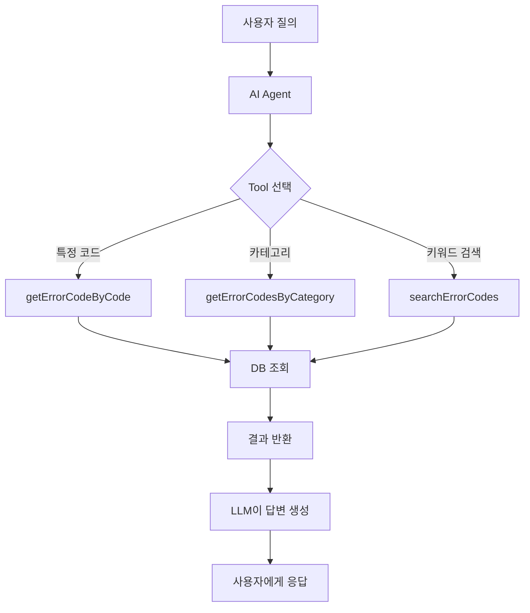

# LangChain4j Function Calling 기능 도입 계획

## 📋 현재 프로젝트 상태 분석

### 현재 구조

1. **메모리 기반 저장소**: `InMemoryErrorCodeRepository`에서 하드코딩된 10개의 에러 코드를 관리
2. **단순 프롬프트 방식**: `ErrorCodeService`가 모든 에러 코드를 컨텍스트에 포함하여 LLM에 질의
3. **성능 이슈**: 전체 에러 코드를 매번 프롬프트에 포함 (확장성 문제)

### 주요 파일

- [ErrorCodeService.kt](file:///Users/song/dev/ai_study/lec2_lang_chain_01/src/main/kotlin/com/example/langchain/service/ErrorCodeService.kt) - AI 질의응답 서비스
- [InMemoryErrorCodeRepository.kt](file:///Users/song/dev/ai_study/lec2_lang_chain_01/src/main/kotlin/com/example/langchain/repository/InMemoryErrorCodeRepository.kt) - 메모리 기반 저장소
- [ErrorCode.kt](file:///Users/song/dev/ai_study/lec2_lang_chain_01/src/main/kotlin/com/example/langchain/domain/ErrorCode.kt) - 도메인 모델

### 현재 동작 방식

```kotlin
// ErrorCodeService.kt의 현재 방식
fun queryErrorCode(query: String): String {
    val errorCodes = errorCodeRepository.findAll()  // 모든 데이터 조회
    val prompt = buildPrompt(errorCodes, query)     // 전체를 프롬프트에 포함
    return chatLanguageModel.generate(prompt)        // LLM 호출
}
```

### 문제점

- ❌ 에러 코드가 많아지면 프롬프트 크기가 커져 성능 저하
- ❌ DB 연동이 안되어 있어 동적 관리 불가
- ❌ LangChain4j의 **Tool/Function Calling** 기능을 활용하지 않음
- ❌ 메모리 기반이라 재시작 시 데이터 초기화

## 🎯 개선 방안: LangChain4j Tool/Function Calling 활용

### LangChain4j의 Tool 기능이란?

LLM이 필요한 경우에만 특정 함수를 호출하여 정보를 가져오는 기능입니다.

**동작 흐름 예시:**

```
사용자: "ERR001 에러가 뭐야?"
    ↓
AI가 분석: 특정 코드를 찾아야 함
    ↓
Tool 선택: getErrorCodeByCode("ERR001")
    ↓
DB에서 ERR001 조회
    ↓
결과를 LLM에 반환
    ↓
최종 답변: "ERR001은 Invalid credentials 에러입니다. 제공된 사용자 이름 또는 비밀번호가 올바르지 않습니다..."
```

### 개선된 아키텍처



## 🔧 구현 계획

### Phase 1: DB 연동 (H2 Database)

> [!IMPORTANT]
> 먼저 H2를 사용하여 빠르게 DB 연동을 구현한 후, 추후 PostgreSQL로 전환 가능

#### 1-1. 의존성 추가

```kotlin
// build.gradle.kts
dependencies {
    // JPA
    implementation("org.springframework.boot:spring-boot-starter-data-jpa")
    
    // H2 Database
    runtimeOnly("com.h2database:h2")
}
```

#### 1-2. JPA Entity 변환

```kotlin
// domain/ErrorCode.kt
@Entity
@Table(name = "error_codes")
data class ErrorCode(
    @Id
    @Column(length = 20)
    val code: String,
    
    @Column(nullable = false)
    val message: String,
    
    @Column(nullable = false, length = 1000)
    val description: String,
    
    @Column(nullable = false, length = 50)
    val category: String
)
```

#### 1-3. JPA Repository 구현

```kotlin
// repository/ErrorCodeRepository.kt
interface ErrorCodeRepository : JpaRepository<ErrorCode, String> {
    fun findByCategory(category: String): List<ErrorCode>
    fun findByCodeContainingOrMessageContaining(code: String, message: String): List<ErrorCode>
}
```

#### 1-4. 초기 데이터 로딩

```kotlin
// config/DataInitializer.kt
@Component
class DataInitializer(
    private val errorCodeRepository: ErrorCodeRepository
) : CommandLineRunner {
    override fun run(vararg args: String?) {
        // 기존 InMemoryErrorCodeRepository의 데이터를 DB에 저장
    }
}
```

---

### Phase 2: LangChain4j Tools 구현

#### 2-1. Tool 클래스 생성

```kotlin
// service/ErrorCodeTools.kt
@Component
class ErrorCodeTools(
    private val errorCodeRepository: ErrorCodeRepository
) {
    
    @Tool("특정 에러 코드의 상세 정보를 조회합니다")
    fun getErrorCodeByCode(
        @P("조회할 에러 코드 (예: ERR001)") code: String
    ): ErrorCode? {
        return errorCodeRepository.findById(code).orElse(null)
    }
    
    @Tool("특정 카테고리의 모든 에러 코드를 조회합니다")
    fun getErrorCodesByCategory(
        @P("카테고리 이름 (예: AUTHENTICATION, VALIDATION)") category: String
    ): List<ErrorCode> {
        return errorCodeRepository.findByCategory(category)
    }
    
    @Tool("키워드로 에러 코드를 검색합니다")
    fun searchErrorCodes(
        @P("검색 키워드") keyword: String
    ): List<ErrorCode> {
        return errorCodeRepository.findByCodeContainingOrMessageContaining(keyword, keyword)
    }
    
    @Tool("등록된 모든 카테고리 목록을 조회합니다")
    fun getAllCategories(): List<String> {
        return errorCodeRepository.findAll()
            .map { it.category }
            .distinct()
            .sorted()
    }
}
```

#### 2-2. AI Service 인터페이스 정의

```kotlin
// service/ErrorCodeAiService.kt
interface ErrorCodeAiService {
    
    @SystemMessage("""
        당신은 에러 코드 전문가입니다.
        사용자의 질문을 분석하고 필요한 도구를 사용하여 정확한 정보를 제공하세요.
        
        답변 가이드:
        - 특정 에러 코드에 대한 질문: getErrorCodeByCode 사용
        - 카테고리별 조회: getErrorCodesByCategory 사용
        - 검색 필요 시: searchErrorCodes 사용
        - 한글로 친절하게 답변하세요
    """)
    fun answerQuestion(
        @UserMessage question: String
    ): String
}
```

#### 2-3. AI Service 구성

```kotlin
// config/LangChainConfig.kt
@Configuration
class LangChainConfig {
    
    @Bean
    fun errorCodeAiService(
        chatLanguageModel: ChatLanguageModel,
        errorCodeTools: ErrorCodeTools
    ): ErrorCodeAiService {
        return AiServices.builder(ErrorCodeAiService::class.java)
            .chatLanguageModel(chatLanguageModel)
            .tools(errorCodeTools)
            .build()
    }
}
```

---

### Phase 3: Service Layer 개선

#### 3-1. ErrorCodeService 리팩토링

```kotlin
// service/ErrorCodeService.kt
@Service
class ErrorCodeService(
    private val errorCodeAiService: ErrorCodeAiService
) {
    
    fun queryErrorCode(query: String): String {
        // AI Service가 자동으로 필요한 Tool을 선택하여 호출
        return errorCodeAiService.answerQuestion(query)
    }
}
```

기존 코드 대비 **훨씬 간단**해집니다!

---

### Phase 4: 테스트 작성 (TDD)

#### 4-1. Tools 단위 테스트

```kotlin
// test/.../service/ErrorCodeToolsTest.kt
@DataJpaTest
class ErrorCodeToolsTest {
    
    @Test
    fun `특정 에러 코드 조회`() {
        val result = errorCodeTools.getErrorCodeByCode("ERR001")
        assertThat(result).isNotNull
        assertThat(result?.message).isEqualTo("Invalid credentials")
    }
    
    @Test
    fun `카테고리별 조회`() {
        val result = errorCodeTools.getErrorCodesByCategory("AUTHENTICATION")
        assertThat(result).hasSize(3)
    }
}
```

#### 4-2. AI Service 통합 테스트

```kotlin
@SpringBootTest
class ErrorCodeAiServiceIntegrationTest {
    
    @Test
    fun `ERR001 에러 코드 질의`() {
        val answer = errorCodeAiService.answerQuestion("ERR001이 뭐야?")
        assertThat(answer).contains("Invalid credentials")
    }
}
```

---

## 📊 비교: Before & After

### Before (현재)

```kotlin
// 모든 에러 코드를 프롬프트에 포함
val errorCodes = repository.findAll()  // 10개 → 1000개 되면?
val prompt = """
    에러 코드 목록:
    ERR001: ...
    ERR002: ...
    ... (1000개)
    
    질문: ${query}
"""
```

**문제:**
- ❌ 토큰 낭비
- ❌ 느린 응답
- ❌ 확장성 없음

### After (개선)

```kotlin
// AI가 필요한 것만 조회
errorCodeAiService.answerQuestion(query)
// → AI가 자동으로 getErrorCodeByCode("ERR001") 호출
```

**장점:**
- ✅ 필요한 데이터만 조회
- ✅ 빠른 응답
- ✅ 무한 확장 가능
- ✅ DB 기반으로 동적 관리

---

## 🚀 실행 계획

### 우선순위

1. **[HIGH]** Phase 1: H2 DB 연동 및 JPA 설정
2. **[HIGH]** Phase 2: Tools 구현
3. **[MEDIUM]** Phase 3: AI Service 연동
4. **[MEDIUM]** Phase 4: 테스트 작성
5. **[LOW]** Phase 5: PostgreSQL 전환 (선택)

### 예상 소요 시간

- Phase 1: 30분
- Phase 2: 45분
- Phase 3: 30분
- Phase 4: 45분
- **총 2.5시간**

---

## 📚 참고 자료

### LangChain4j 공식 문서

- [Tools Documentation](https://docs.langchain4j.dev/tutorials/tools)
- [AI Services](https://docs.langchain4j.dev/tutorials/ai-services)

### 예제 코드

```kotlin
// Tool 정의 예시
@Tool("날씨 정보를 조회합니다")
fun getWeather(@P("도시 이름") city: String): String {
    return "서울의 날씨는 맑습니다"
}

// AI Service 사용 예시
interface WeatherAssistant {
    fun askAboutWeather(question: String): String
}
```

---

## ✅ 체크리스트

- [ ] H2 의존성 추가
- [ ] ErrorCode Entity 변환
- [ ] JPA Repository 구현
- [ ] 초기 데이터 로딩
- [ ] ErrorCodeTools 클래스 작성
- [ ] ErrorCodeAiService 인터페이스 작성
- [ ] LangChainConfig 수정
- [ ] ErrorCodeService 리팩토링
- [ ] 단위 테스트 작성
- [ ] 통합 테스트 작성
- [ ] API 동작 검증

---

## 🎯 다음 단계

이제 구현을 시작하시겠습니까? TDD 방식으로 단계별로 진행하겠습니다!

**진행 방법:**
1. 먼저 테스트 작성
2. 테스트 실패 확인
3. 코드 구현
4. 테스트 통과 확인
5. 리팩토링
