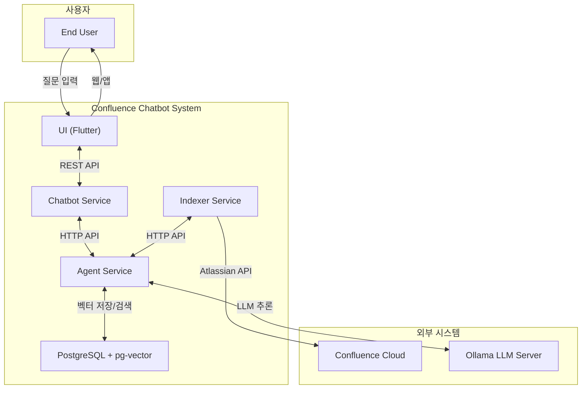
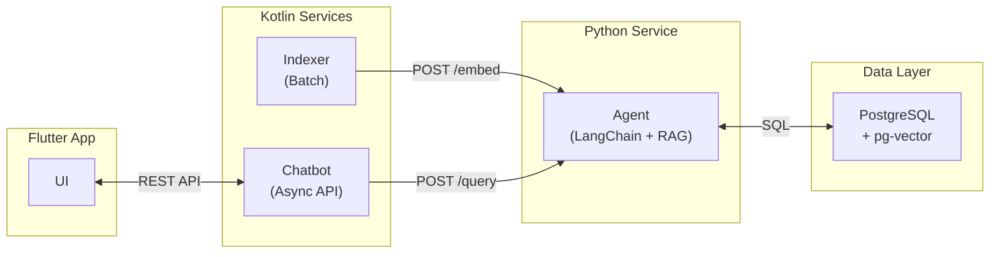
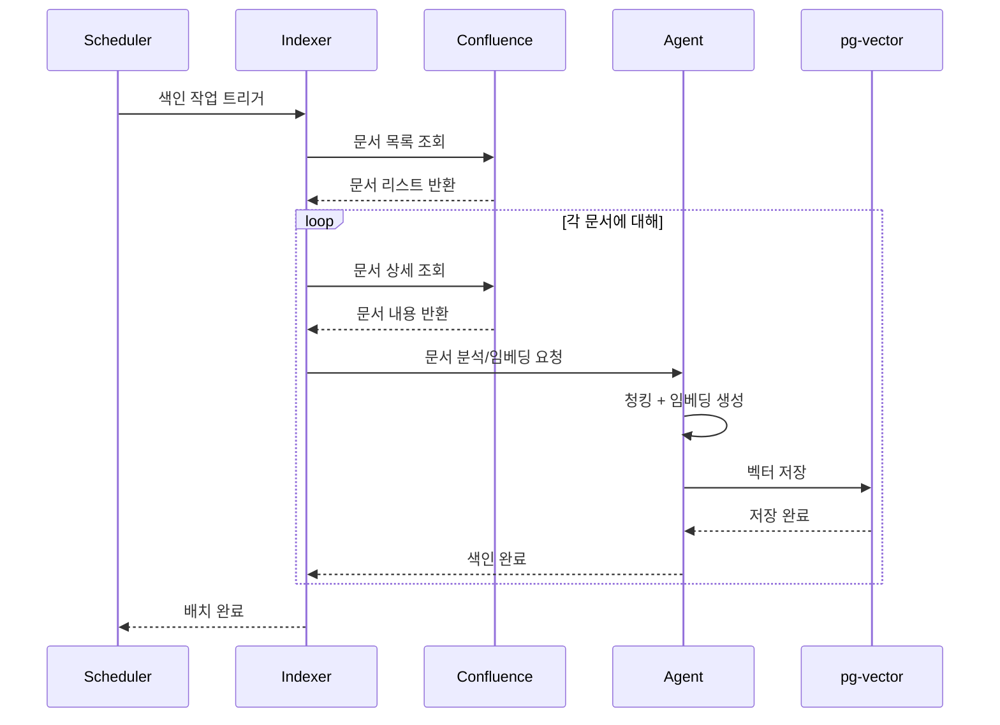
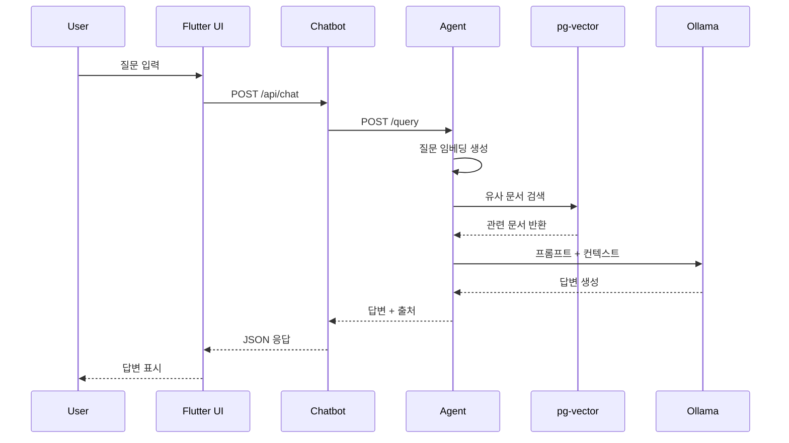
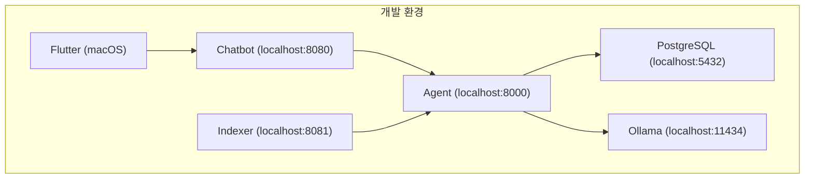

# Confluence Chatbot - 시스템 컨텍스트 (System Context)

## 1. 개요
본 문서는 Confluence Chatbot 시스템의 전체 컨텍스트와 외부 시스템과의 관계를 정의합니다.

---

## 2. 시스템 컨텍스트 다이어그램

---

## 3. 외부 시스템 인터페이스

### 3.1 Confluence Cloud

| 항목 | 내용 |
|-----|------|
| **연동 목적** | 문서 조회 및 색인 |
| **프로토콜** | HTTPS REST API |
| **인증 방식** | API Token (Basic Auth) 또는 OAuth 2.0 |
| **API 버전** | Atlassian REST API v2 |
| **주요 엔드포인트** | `/wiki/rest/api/content`, `/wiki/rest/api/space` |

### 3.2 Ollama LLM Server

| 항목 | 내용 |
|-----|------|
| **연동 목적** | 자연어 처리 및 답변 생성 |
| **프로토콜** | HTTP REST API |
| **기본 포트** | 11434 |
| **배포 위치** | 로컬 서버 |
| **API 형식** | OpenAI 호환 API |

---

## 4. 내부 컴포넌트 관계

---

## 5. 데이터 흐름

### 5.1 문서 색인 흐름 (Indexing Flow)

### 5.2 질문 응답 흐름 (Query Flow)

---

## 6. 배포 컨텍스트

---

## 7. 주요 액터 정의

| 액터 | 역할 | 설명 |
|-----|------|------|
| **End User** | 질문자 | Confluence 문서에 대해 질문하는 사용자 |
| **Scheduler** | 트리거 | 색인 배치 작업을 주기적으로 실행 |
| **Admin** | 관리자 | 시스템 설정 및 모니터링 담당 (향후) |

---

## 변경 이력

| 버전 | 날짜 | 작성자 | 변경 내용 |
|-----|------|-------|----------|
| 0.1 | 2026-01-19 | Antigravity | 초안 작성 |
