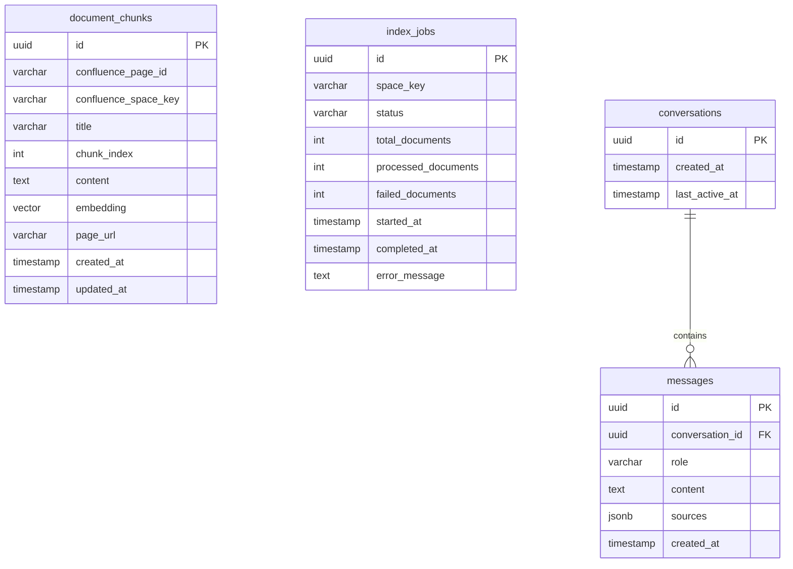

# Confluence Chatbot - 데이터베이스 설계

## 1. 개요

본 문서는 Confluence Chatbot 시스템의 데이터베이스 스키마를 정의합니다.

### 1.1 사용 기술

| 항목 | 내용 |
|-----|------|
| **DBMS** | PostgreSQL 15+ |
| **벡터 확장** | pgvector |
| **임베딩 차원** | 384 (sentence-transformers/all-MiniLM-L6-v2) |

---

## 2. ERD (Entity Relationship Diagram)



---

## 3. 테이블 상세

### 3.1 document_chunks

문서 청크 및 벡터 임베딩을 저장합니다.

```sql
CREATE EXTENSION IF NOT EXISTS vector;
CREATE EXTENSION IF NOT EXISTS "uuid-ossp";

CREATE TABLE document_chunks (
    id UUID PRIMARY KEY DEFAULT uuid_generate_v4(),
    
    -- Confluence 메타데이터
    confluence_page_id VARCHAR(50) NOT NULL,
    confluence_space_key VARCHAR(20) NOT NULL,
    title VARCHAR(500) NOT NULL,
    page_url VARCHAR(1000),
    
    -- 청크 데이터
    chunk_index INTEGER NOT NULL,
    content TEXT NOT NULL,
    
    -- 벡터 임베딩 (all-MiniLM-L6-v2: 384차원)
    embedding vector(384),
    
    -- 타임스탬프
    created_at TIMESTAMP WITH TIME ZONE DEFAULT CURRENT_TIMESTAMP,
    updated_at TIMESTAMP WITH TIME ZONE DEFAULT CURRENT_TIMESTAMP,
    
    -- 제약조건
    CONSTRAINT uq_page_chunk UNIQUE (confluence_page_id, chunk_index)
);

-- 인덱스
CREATE INDEX idx_chunks_space_key ON document_chunks(confluence_space_key);
CREATE INDEX idx_chunks_page_id ON document_chunks(confluence_page_id);

-- 벡터 유사도 검색용 IVFFlat 인덱스
CREATE INDEX idx_chunks_embedding ON document_chunks 
USING ivfflat (embedding vector_cosine_ops)
WITH (lists = 100);

-- updated_at 자동 갱신 트리거
CREATE OR REPLACE FUNCTION update_updated_at()
RETURNS TRIGGER AS $$
BEGIN
    NEW.updated_at = CURRENT_TIMESTAMP;
    RETURN NEW;
END;
$$ LANGUAGE plpgsql;

CREATE TRIGGER trg_chunks_updated_at
    BEFORE UPDATE ON document_chunks
    FOR EACH ROW
    EXECUTE FUNCTION update_updated_at();
```

#### 컬럼 설명

| 컬럼 | 타입 | 설명 |
|-----|------|------|
| id | UUID | 기본 키 |
| confluence_page_id | VARCHAR(50) | Confluence 페이지 고유 ID |
| confluence_space_key | VARCHAR(20) | Confluence Space 키 |
| title | VARCHAR(500) | 페이지 제목 |
| page_url | VARCHAR(1000) | Confluence 페이지 URL |
| chunk_index | INTEGER | 청크 순서 (0부터 시작) |
| content | TEXT | 청크 텍스트 내용 |
| embedding | vector(384) | 벡터 임베딩 |
| created_at | TIMESTAMP | 생성 시각 |
| updated_at | TIMESTAMP | 수정 시각 |

---

### 3.2 index_jobs

색인 작업 이력을 저장합니다.

```sql
CREATE TABLE index_jobs (
    id UUID PRIMARY KEY DEFAULT uuid_generate_v4(),
    
    -- 작업 정보
    space_key VARCHAR(20) NOT NULL,
    full_reindex BOOLEAN DEFAULT FALSE,
    
    -- 상태
    status VARCHAR(20) NOT NULL DEFAULT 'pending',
    -- 'pending', 'running', 'completed', 'failed'
    
    -- 진행 상황
    total_documents INTEGER DEFAULT 0,
    processed_documents INTEGER DEFAULT 0,
    failed_documents INTEGER DEFAULT 0,
    
    -- 타임스탬프
    started_at TIMESTAMP WITH TIME ZONE,
    completed_at TIMESTAMP WITH TIME ZONE,
    
    -- 에러 정보
    error_message TEXT,
    
    created_at TIMESTAMP WITH TIME ZONE DEFAULT CURRENT_TIMESTAMP
);

-- 인덱스
CREATE INDEX idx_jobs_status ON index_jobs(status);
CREATE INDEX idx_jobs_space_key ON index_jobs(space_key);
CREATE INDEX idx_jobs_created_at ON index_jobs(created_at DESC);
```

---

### 3.3 conversations

대화 세션을 저장합니다.

```sql
CREATE TABLE conversations (
    id UUID PRIMARY KEY DEFAULT uuid_generate_v4(),
    
    created_at TIMESTAMP WITH TIME ZONE DEFAULT CURRENT_TIMESTAMP,
    last_active_at TIMESTAMP WITH TIME ZONE DEFAULT CURRENT_TIMESTAMP
);

-- 인덱스
CREATE INDEX idx_conv_last_active ON conversations(last_active_at DESC);
```

---

### 3.4 messages

대화 메시지를 저장합니다.

```sql
CREATE TABLE messages (
    id UUID PRIMARY KEY DEFAULT uuid_generate_v4(),
    
    -- 대화 참조
    conversation_id UUID NOT NULL REFERENCES conversations(id) ON DELETE CASCADE,
    
    -- 메시지 정보
    role VARCHAR(20) NOT NULL,  -- 'user' | 'assistant'
    content TEXT NOT NULL,
    
    -- 출처 정보 (assistant 메시지에만 해당)
    sources JSONB,
    
    created_at TIMESTAMP WITH TIME ZONE DEFAULT CURRENT_TIMESTAMP
);

-- 인덱스
CREATE INDEX idx_msg_conversation ON messages(conversation_id, created_at);
```

#### sources JSONB 구조

```json
[
  {
    "page_id": "12345",
    "title": "휴가 정책 가이드",
    "url": "https://company.atlassian.net/wiki/...",
    "relevance_score": 0.95
  }
]
```

---

## 4. 초기화 스크립트

### 4.1 init.sql

Docker 컨테이너 초기화 시 실행되는 스크립트입니다.

```sql
-- init.sql

-- 확장 활성화
CREATE EXTENSION IF NOT EXISTS vector;
CREATE EXTENSION IF NOT EXISTS "uuid-ossp";

-- document_chunks 테이블
CREATE TABLE IF NOT EXISTS document_chunks (
    id UUID PRIMARY KEY DEFAULT uuid_generate_v4(),
    confluence_page_id VARCHAR(50) NOT NULL,
    confluence_space_key VARCHAR(20) NOT NULL,
    title VARCHAR(500) NOT NULL,
    page_url VARCHAR(1000),
    chunk_index INTEGER NOT NULL,
    content TEXT NOT NULL,
    embedding vector(384),
    created_at TIMESTAMP WITH TIME ZONE DEFAULT CURRENT_TIMESTAMP,
    updated_at TIMESTAMP WITH TIME ZONE DEFAULT CURRENT_TIMESTAMP,
    CONSTRAINT uq_page_chunk UNIQUE (confluence_page_id, chunk_index)
);

CREATE INDEX IF NOT EXISTS idx_chunks_space_key ON document_chunks(confluence_space_key);
CREATE INDEX IF NOT EXISTS idx_chunks_page_id ON document_chunks(confluence_page_id);

-- index_jobs 테이블
CREATE TABLE IF NOT EXISTS index_jobs (
    id UUID PRIMARY KEY DEFAULT uuid_generate_v4(),
    space_key VARCHAR(20) NOT NULL,
    full_reindex BOOLEAN DEFAULT FALSE,
    status VARCHAR(20) NOT NULL DEFAULT 'pending',
    total_documents INTEGER DEFAULT 0,
    processed_documents INTEGER DEFAULT 0,
    failed_documents INTEGER DEFAULT 0,
    started_at TIMESTAMP WITH TIME ZONE,
    completed_at TIMESTAMP WITH TIME ZONE,
    error_message TEXT,
    created_at TIMESTAMP WITH TIME ZONE DEFAULT CURRENT_TIMESTAMP
);

-- conversations 테이블
CREATE TABLE IF NOT EXISTS conversations (
    id UUID PRIMARY KEY DEFAULT uuid_generate_v4(),
    created_at TIMESTAMP WITH TIME ZONE DEFAULT CURRENT_TIMESTAMP,
    last_active_at TIMESTAMP WITH TIME ZONE DEFAULT CURRENT_TIMESTAMP
);

-- messages 테이블
CREATE TABLE IF NOT EXISTS messages (
    id UUID PRIMARY KEY DEFAULT uuid_generate_v4(),
    conversation_id UUID NOT NULL REFERENCES conversations(id) ON DELETE CASCADE,
    role VARCHAR(20) NOT NULL,
    content TEXT NOT NULL,
    sources JSONB,
    created_at TIMESTAMP WITH TIME ZONE DEFAULT CURRENT_TIMESTAMP
);

CREATE INDEX IF NOT EXISTS idx_msg_conversation ON messages(conversation_id, created_at);

-- updated_at 트리거
CREATE OR REPLACE FUNCTION update_updated_at()
RETURNS TRIGGER AS $$
BEGIN
    NEW.updated_at = CURRENT_TIMESTAMP;
    RETURN NEW;
END;
$$ LANGUAGE plpgsql;

DROP TRIGGER IF EXISTS trg_chunks_updated_at ON document_chunks;
CREATE TRIGGER trg_chunks_updated_at
    BEFORE UPDATE ON document_chunks
    FOR EACH ROW
    EXECUTE FUNCTION update_updated_at();
```

---

## 5. 쿼리 예제

### 5.1 벡터 유사도 검색

```sql
-- 코사인 유사도 기반 Top-K 검색
SELECT 
    id,
    title,
    content,
    page_url,
    1 - (embedding <=> $1) AS similarity
FROM document_chunks
WHERE confluence_space_key = $2
ORDER BY embedding <=> $1
LIMIT $3;
```

### 5.2 페이지별 청크 삭제 (재색인 시)

```sql
DELETE FROM document_chunks
WHERE confluence_page_id = $1;
```

### 5.3 Space 전체 문서 수 조회

```sql
SELECT 
    COUNT(DISTINCT confluence_page_id) AS page_count,
    COUNT(*) AS chunk_count
FROM document_chunks
WHERE confluence_space_key = $1;
```

---

## 6. 데이터 관리

### 6.1 용량 예측

| 항목 | 예상치 | 비고 |
|-----|-------|------|
| 문서 수 | 500 페이지 | Space 당 |
| 페이지당 청크 수 | 5~10개 | 평균 |
| 총 청크 수 | 2,500~5,000 | |
| 청크당 임베딩 크기 | ~1.5KB | 384 * 4 bytes |
| 총 벡터 크기 | ~7.5MB | |

### 6.2 유지보수

```sql
-- 벡터 인덱스 재구축 (데이터 대량 변경 후)
REINDEX INDEX idx_chunks_embedding;

-- 테이블 통계 갱신
ANALYZE document_chunks;
```

---

## 변경 이력

| 버전 | 날짜 | 작성자 | 변경 내용 |
|-----|------|-------|----------|
| 0.1 | 2026-01-19 | Antigravity | 초안 작성 |
